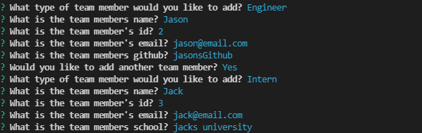

# Team Generator

## Landing Page

This is a generator that makes a dynamic number of team members and writes an html file to display them. This repo makes use of classes to generate better more legible objects for the node fs generator. The repo also makes use of the JEST library to test the classes for functionality.

## Link
Make sure to click [here](https://watch.screencastify.com/v/OeocogFk3nOG6fWDoymf) to view the finished LIVE copy of the assignment.

## screenshot 

